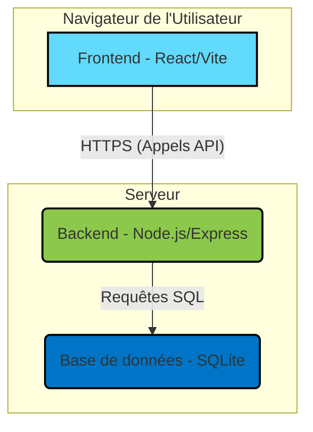

# 🏛️ MediaVault

[](https://nodejs.org/)
[](https://expressjs.com/)
[](https://reactjs.org/)
[](https://vitejs.dev/)
[](https://tailwindcss.com/)
[](https://www.sqlite.org/index.html)
[](https://opensource.org/licenses/MIT)

MediaVault est une application web full-stack conçue pour être votre bibliothèque numérique personnelle. Elle vous permet de cataloguer, gérer et suivre méticuleusement l'ensemble de votre collection de médias.

---

## Navigation

- [Architecture](#architecture)
- [À Propos du Projet](#à-propos-du-projet)
- [Fonctionnalités Clés](#fonctionnalités-clés)
- [Structure des Dossiers](#structure-des-dossiers)
- [Démarrage](#démarrage)
  - [Prérequis](#prérequis)
  - [Installation](#installation)
- [Utilisation](#utilisation)
- [Endpoints de l'API](#endpoints-de-lapi)
- [Contribuer](#contribuer)
- [Licence](#licence)

---

## Architecture

Le projet est construit sur un modèle client-serveur classique, assurant une séparation claire des responsabilités entre le frontend et le backend.



---

## À Propos du Projet

MediaVault a été créé pour fournir une solution unique et élégante pour la gestion d'une bibliothèque de médias personnels diversifiée. Que vous soyez un lecteur avide, un cinéphile ou un joueur passionné, cet outil vous aide à tout organiser.

### Stack Technique

- **Backend**: Node.js, Express.js, SQLite, JWT
- **Frontend**: React, Vite, Tailwind CSS, DaisyUI, React Router, Axios, Recharts

---

## Fonctionnalités Clés

-   👤 **Authentification Utilisateur**: Système d'inscription et de connexion sécurisé avec JWT.
-   📚 **Gestion de la Bibliothèque**: Capacités CRUD complètes pour tous vos médias.
-   🗂️ **Collections Personnalisées**: Regroupez vos médias dans des collections thématiques.
-   🤝 **Suivi des Prêts**: Gardez une trace des articles prêtés à des amis.
-   💡 **Liste de Souhaits**: Maintenez une liste de médias que vous souhaitez acquérir.
-   ⭐ **Évaluations & Critiques**: Notez vos médias sur une échelle de 5 étoiles et rédigez des critiques.
-   📊 **Suivi de Progression**: Surveillez votre progression pour les livres (par page) et les séries (par épisode).
-   📈 **Tableau de Bord Statistique**: Visualisez votre bibliothèque avec des graphiques.
-   🎨 **Thème Double**: Une interface utilisateur réactive avec des modes Clair et Sombre personnalisés.

---

## Structure des Dossiers

```
/MediaVault
├── backend/
│   ├── src/
│   │   ├── config/       # Configuration de la base de données
│   │   ├── controllers/  # Logique métier des routes API
│   │   ├── middleware/   # Middleware Express (ex: authentification)
│   │   ├── models/       # Schéma de la base de données (.sql)
│   │   └── routes/       # Définitions des routes de l'API
│   └── server.js       # Point d'entrée principal du serveur
└── frontend/
    ├── src/
    │   ├── components/   # Composants React réutilisables
    │   ├── context/      # État global (Auth, Theme)
    │   ├── pages/        # Composants de page principaux
    │   └── services/     # Couche de communication API
    └── main.jsx        # Point d'entrée principal de React
```

---

## Démarrage

Suivez ces étapes pour faire fonctionner le projet sur votre machine locale.

### Prérequis

-   [Node.js](https://nodejs.org/) (v18.x ou ultérieure recommandée)
-   [npm](https://www.npmjs.com/) (inclus avec Node.js)

### Installation

1.  **Clonez le dépôt :**
    ```bash
    git clone <votre-url-de-depot>
    cd MediaVault
    ```

2.  **Configurez le Backend :**
    ```bash
    cd backend
    npm install
    ```
    Créez un fichier `.env` dans le dossier `backend` pour spécifier les variables suivantes (des valeurs par défaut sont utilisées sinon) :
    ```env
    PORT=5000
    JWT_SECRET=votre_cle_secrete_jwt
    ```

3.  **Configurez le Frontend :**
    ```bash
    cd ../frontend
    npm install
    ```

---

## Utilisation

Pour lancer l'application, vous devez démarrer les serveurs backend et frontend dans deux terminaux distincts.

-   **Lancer le serveur Backend :**
    Depuis le dossier `backend` :
    ```bash
    npm start
    ```
    Le serveur API démarrera sur `http://localhost:5000`.

-   **Lancer le serveur de développement Frontend :**
    Depuis le dossier `frontend` :
    ```bash
    npm run dev
    ```
    L'application React sera disponible sur `http://localhost:5173`.

---

## Endpoints de l'API

| Méthode | Endpoint                      | Description                               |
| :----- | :---------------------------- | :---------------------------------------- |
| POST   | `/api/auth/register`          | Inscrire un nouvel utilisateur.           |
| POST   | `/api/auth/login`             | Connecter un utilisateur et obtenir un JWT.|
| GET    | `/api/media`                  | Obtenir tous les médias de l'utilisateur. |
| POST   | `/api/media`                  | Créer un nouveau média.                   |
| GET    | `/api/collections`            | Obtenir toutes les collections.           |
| POST   | `/api/collections`            | Créer une nouvelle collection.            |
| GET    | `/api/loans`                  | Obtenir tous les prêts actifs.            |
| POST   | `/api/loans`                  | Créer un nouveau prêt.                    |
| GET    | `/api/stats/overview`         | Obtenir les statistiques de la bibliothèque.|

---

## Contribuer

Les contributions sont ce qui rend la communauté open-source un endroit incroyable pour apprendre, inspirer et créer. Toute contribution que vous faites est **grandement appréciée**.

1.  Forkez le Projet
2.  Créez votre branche de fonctionnalité (`git checkout -b feature/AmazingFeature`)
3.  Commitez vos changements (`git commit -m 'Add some AmazingFeature'`)
4.  Poussez vers la branche (`git push origin feature/AmazingFeature`)
5.  Ouvrez une Pull Request

---

## Licence

Distribué sous la licence MIT. Voir `LICENSE` pour plus d'informations.