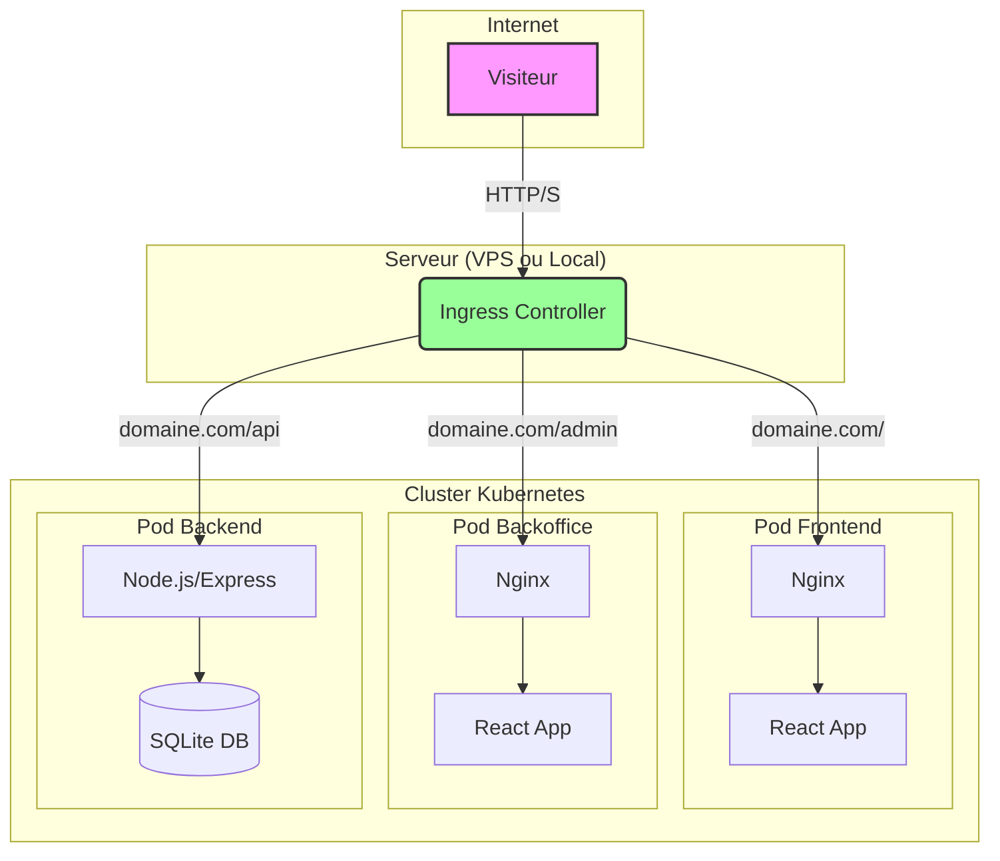

# 🏛️ MediaVault

[](https://reactjs.org/)
[](https://nodejs.org/)
[](https://kubernetes.io/)
[](https://www.docker.com/)
[](https://www.nginx.com/)
[](https://expressjs.com/)
[](https://vitejs.dev/)
[](https://tailwindcss.com/)
[](https://daisyui.com/)
[](https://www.framer.com/motion/)
[](https://reactrouter.com/)
[](https://axios-http.com/)
[](https://recharts.org/)
[](https://www.sqlite.org/index.html)
[](https://jwt.io/)
[](https://react.i18next.com)
[](https://opensource.org/licenses/MIT)

MediaVault est une application web full-stack conçue pour être votre bibliothèque numérique personnelle. Elle vous permet de cataloguer, gérer et suivre méticuleusement l'ensemble de votre collection de médias.

---

## Navigation

- [Architecture](#architecture)
- [À Propos du Projet](#à-propos-du-projet)
- [Fonctionnalités Clés](#fonctionnalités-clés)
- [Démarrage et Déploiement](#démarrage-et-déploiement)
  - [Méthode 1: Déploiement avec Kubernetes (Recommandé)](#méthode-1-déploiement-avec-kubernetes-recommandé)
  - [Méthode 2: Lancement Manuel pour le Développement](#méthode-2-lancement-manuel-pour-le-développement)
- [Structure des Dossiers](#structure-des-dossiers)
- [Endpoints de l'API](#endpoints-de-lapi)
- [Contribuer](#contribuer)
- [Licence](#licence)

---

## Architecture

Le projet est conteneurisé avec Docker et orchestré par Kubernetes. Un Ingress Controller agit comme point d'entrée unique, routant le trafic vers les différents services (frontend, backend, backoffice) au sein du cluster.



---

## À Propos du Projet

MediaVault a été créé pour fournir une solution unique et élégante pour la gestion d'une bibliothèque de médias personnels diversifiée. Que vous soyez un lecteur avide, un cinéphile ou un joueur passionné, cet outil vous aide à tout organiser.

### Stack Technique

- **Backend**: Node.js, Express.js, SQLite, JWT
- **Frontend & Backoffice**: React, Vite, Tailwind CSS, DaisyUI, React Router, Axios, Recharts, i18next, Framer Motion
- **Infrastructure**: Docker, Kubernetes (K3s/Minikube), Nginx, Ingress

---

## Fonctionnalités Clés

-   👤 **Authentification Utilisateur**: Système d'inscription et de connexion sécurisé avec JWT.
-   📚 **Gestion de la Bibliothèque**: Capacités CRUD complètes pour tous vos médias.
-   🗂️ **Collections Personnalisées**: Regroupez vos médias dans des collections thématiques.
-   🤝 **Suivi des Prêts**: Gardez une trace des articles prêtés à des amis.
-   💡 **Liste de Souhaits**: Maintenez une liste de médias que vous souhaitez acquérir.
-   ⭐ **Évaluations & Critiques**: Notez vos médias sur une échelle de 5 étoiles et rédigez des critiques.
-   📊 **Suivi de Progression**: Surveillez votre progression pour les livres et les séries.
-   📈 **Tableau de Bord Statistique**: Visualisez votre bibliothèque avec des graphiques.
-   🎨 **Thème Double**: Modes Clair et Sombre.
-   🌐 **Localisation**: Prise en charge multilingue (FR, EN, ES, DE, ZH).

---

## Démarrage et Déploiement

### Méthode 1: Déploiement avec Kubernetes (Recommandé)

C'est la méthode conseillée pour lancer l'ensemble de l'application, que ce soit en local ou sur un serveur.

#### Prérequis
- [Docker](https://www.docker.com/products/docker-desktop/)
- [Git](https://git-scm.com/)
- Un orchestrateur Kubernetes :
  - Pour un environnement local : [Minikube](https://minikube.sigs.k8s.io/docs/start/)
  - Pour un serveur/VPS : [K3s](https://k3s.io/)

#### Option A: Déploiement en Local avec Minikube

1.  **Démarrez Minikube :** `minikube start`
2.  **Clonez le dépôt :** `git clone <votre-url-de-depot> && cd MediaVault`
3.  **Lancez le script :** `chmod +x build-push-deploy-local.sh && ./build-push-deploy-local.sh`
4.  **Accédez à l'application :**
    - Frontend: `http://$(minikube ip)/`
    - Backoffice: `http://$(minikube ip)/admin/`

#### Option B: Déploiement sur un VPS avec K3s

1.  **Préparez votre VPS :** Assurez-vous que Git, Docker et K3s sont installés.
2.  **Clonez le dépôt sur votre VPS :** `git clone <votre-url-de-depot> && cd MediaVault`
3.  **Lancez le script :** `chmod +x build-push-deploy-vps.sh && ./build-push-deploy-vps.sh`
    > **Note :** Assurez-vous d'être connecté à Docker Hub (`docker login`) et que la variable `DOCKER_REGISTRY` dans le script correspond à votre nom d'utilisateur.
4.  **Accédez à l'application :**
    - Frontend: `http://<VOTRE_IP_VPS_OU_DOMAINE>/`
    - Backoffice: `http://<VOTRE_IP_VPS_OU_DOMAINE>/admin/`

### Méthode 2: Lancement Manuel pour le Développement

Utilisez cette méthode si vous souhaitez travailler sur un seul composant (par exemple, le frontend) sans lancer tout l'environnement Kubernetes.

#### Prérequis
-   [Node.js](https://nodejs.org/) (v18.x ou ultérieure recommandée)
-   [npm](https://www.npmjs.com/) (inclus avec Node.js)

#### Installation

1.  **Clonez le dépôt :**
    ```bash
    git clone <votre-url-de-depot>
    cd MediaVault
    ```

2.  **Configurez le Backend :**
    ```bash
    cd backend
    npm install
    ```
    Créez un fichier `.env` dans le dossier `backend` pour spécifier les variables suivantes (des valeurs par défaut sont utilisées sinon) :
    ```env
    PORT=5000
    JWT_SECRET=votre_cle_secrete_jwt
    ```

3.  **Configurez le Frontend :**
    ```bash
    cd ../frontend
    npm install
    ```

#### Utilisation

Pour lancer l'application, vous devez démarrer les serveurs backend et frontend dans deux terminaux distincts.

-   **Lancer le serveur Backend :**
    Depuis le dossier `backend` :
    ```bash
    npm start
    ```
    Le serveur API démarrera sur `http://localhost:5000`.

-   **Lancer le serveur de développement Frontend :**
    Depuis le dossier `frontend` :
    ```bash
    npm run dev
    ```
    L'application React sera disponible sur `http://localhost:5173`.

---

## Structure des Dossiers

```
/MediaVault
├── backend/        # API Node.js & Express
├── backoffice/     # Application d'administration React
├── frontend/       # Application client React
├── k8s/            # Manifestes de déploiement Kubernetes
└── ...
```

---

## Endpoints de l'API

Voici une liste détaillée des endpoints de l'API disponibles, groupés par ressource.

### Authentification (`/api/auth`)

| Méthode | Endpoint         | Description                                  |
| :------ | :--------------- | :------------------------------------------- |
| `POST`  | `/register`      | Inscrire un nouvel utilisateur.              |
| `POST`  | `/login`         | Connecter un utilisateur et obtenir un JWT.  |
| `GET`   | `/profile`       | Obtenir le profil de l'utilisateur connecté. |

### Média (`/api/media`)

| Méthode | Endpoint         | Description                                  |
| :------ | :--------------- | :------------------------------------------- |
| `GET`   | `/`              | Obtenir tous les médias de l'utilisateur.    |
| `POST`  | `/`              | Créer un nouveau média (avec upload d'image).|
| `GET`   | `/:id`           | Obtenir un média par son ID.                 |
| `PUT`   | `/:id`           | Mettre à jour un média par son ID.           |
| `DELETE`| `/:id`           | Supprimer un média par son ID.               |

### Tags (`/api/tags`)

| Méthode | Endpoint         | Description                                  |
| :------ | :--------------- | :------------------------------------------- |
| `GET`   | `/`              | Obtenir tous les tags disponibles.           |
| `POST`  | `/`              | Créer un nouveau tag.                        |
| `PUT`   | `/:id`           | Mettre à jour un tag par son ID.             |
| `DELETE`| `/:id`           | Supprimer un tag par son ID.                 |

### Média-Tags (Routes imbriquées)

| Méthode | Endpoint               | Description                                  |
| :------ | :--------------------- | :------------------------------------------- |
| `GET`   | `/api/media/:id/tags`  | Obtenir les tags d'un média spécifique.      |
| `POST`  | `/api/media/:id/tags`  | Associer un ou plusieurs tags à un média.    |

### Collections (`/api/collections`)

| Méthode | Endpoint               | Description                                  |
| :------ | :--------------------- | :------------------------------------------- |
| `GET`   | `/`                    | Obtenir toutes les collections de l'utilisateur.|
| `POST`  | `/`                    | Créer une nouvelle collection.               |
| `GET`   | `/:id`                 | Obtenir une collection par son ID.           |
| `PUT`   | `/:id`                 | Mettre à jour une collection par son ID.     |
| `DELETE`| `/:id`                 | Supprimer une collection par son ID.         |
| `POST`  | `/:id/media`           | Ajouter un média à une collection.           |
| `DELETE`| `/:id/media/:mediaId`  | Retirer un média d'une collection.           |

### Prêts (`/api/loans`)

| Méthode | Endpoint         | Description                                  |
| :------ | :--------------- | :------------------------------------------- |
| `GET`   | `/`              | Obtenir la liste des prêts actifs.           |
| `POST`  | `/`              | Créer un nouveau prêt.                       |
| `GET`   | `/history`       | Obtenir l'historique des prêts retournés.    |
| `PUT`   | `/:id/return`    | Marquer un prêt comme retourné.              |

### Évaluations (Routes imbriquées)

| Méthode | Endpoint                 | Description                                  |
| :------ | :----------------------- | :------------------------------------------- |
| `GET`   | `/api/media/:id/ratings` | Obtenir l'évaluation d'un média.             |
| `POST`  | `/api/media/:id/ratings` | Ajouter ou mettre à jour l'évaluation d'un média.|
| `DELETE`| `/api/media/:id/ratings` | Supprimer l'évaluation d'un média.           |

### Progression (Routes imbriquées)

| Méthode | Endpoint                 | Description                                  |
| :------ | :----------------------- | :------------------------------------------- |
| `GET`   | `/api/media/:id/progress`| Obtenir la progression de lecture/visionnage.|
| `POST`  | `/api/media/:id/progress`| Mettre à jour la progression.                |

### Statistiques (`/api/stats`)

| Méthode | Endpoint         | Description                                  |
| :------ | :--------------- | :------------------------------------------- |
| `GET`   | `/overview`      | Obtenir les statistiques globales de la bibliothèque.|

### Administration (`/api/admin`)

| Méthode | Endpoint         | Description                                  |
| :------ | :--------------- | :------------------------------------------- |
| `GET`   | `/users`         | Obtenir la liste de tous les utilisateurs.   |
| `PUT`   | `/users/:id`     | Mettre à jour le rôle d'un utilisateur.      |
| `DELETE`| `/users/:id`     | Supprimer un utilisateur.                    |
| `GET`   | `/stats`         | Obtenir les statistiques globales du système.|
| `GET`   | `/media`         | Obtenir tous les médias du système. Peut être filtré par `collection_id`.|
| `PUT`   | `/media/:id`     | Mettre à jour n'importe quel média.          |
| `DELETE`| `/media/:id`     | Supprimer n'importe quel média.              |
| `GET`   | `/collections`   | Obtenir toutes les collections.              |
| `PUT`   | `/collections/:id` | Mettre à jour une collection.                |
| `DELETE`| `/collections/:id` | Supprimer une collection.                    |
| `GET`   | `/loans`         | Obtenir tous les prêts.                      |
| `PUT`   | `/loans/:id`     | Mettre à jour un prêt.                       |
| `DELETE`| `/loans/:id`     | Supprimer un prêt.                           |

---

## Contribuer

Les contributions sont ce qui rend la communauté open-source un endroit incroyable pour apprendre, inspirer et créer. Toute contribution que vous faites est **grandement appréciée**.

1.  Forkez le Projet
2.  Créez votre branche de fonctionnalité (`git checkout -b feature/AmazingFeature`)
3.  Commitez vos changements (`git commit -m 'Add some AmazingFeature'`)
4.  Poussez vers la branche (`git push origin feature/AmazingFeature`)
5.  Ouvrez une Pull Request

---

## Licence

Distribué sous la licence MIT.
